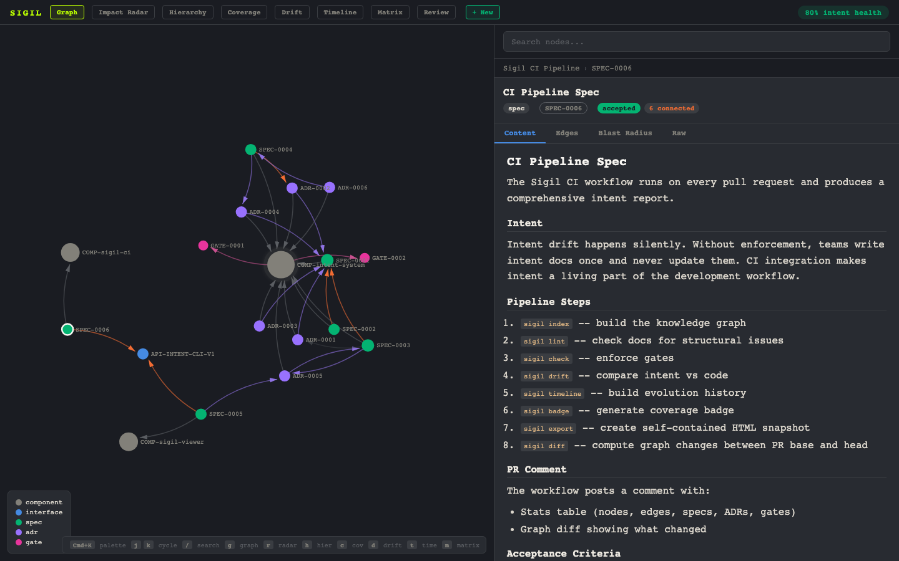

# Sigil

[](https://fielding.github.io/sigil/)

**Version control for architectural decisions. Align product and engineering on specs before a single line of code is written.**

Your team has a meeting. Product describes what they want. Engineering says they can build it. Everyone leaves with a different picture of what "it" is.

Sigil fixes that gap. Write your specs, ADRs, interface contracts, and constraints as structured documents in your repo. Sigil links them into a queryable intent graph — components connected to specs connected to decisions connected to gates. Before anyone writes code, product and engineering review the graph together. Gaps are visible. Disagreements surface. Everyone signs off on the same picture.

Then code is written. And gates ensure it can never drift from what was agreed on.

> **Your codebase knows *what*. Sigil knows *why* — before the first line is written.**

## The workflow

```bash
# 1. Write a spec for what you're building
sigil new spec auth-service "Token refresh flow"

# 2. Record why you made a key technical choice
sigil new adr auth-service "Use JWT with short-lived tokens"

# 3. Define an interface contract between services
sigil new interface orders "API-ORDERS-V1"

# 4. Set a constraint that must hold — forever
sigil new gate "Auth token expiry must be under 1 hour" --applies-to COMP-auth-service

# 5. See the full picture of what your team has agreed to build
sigil serve
```

Opens in your browser: a force-directed graph of every spec, decision, interface, and constraint — linked together, searchable, with coverage gaps highlighted in red.

[](https://fielding.github.io/sigil/)

**[See a live demo →](https://fielding.github.io/sigil/)**

Product sees what's being built and why. Engineering sees the constraints and interfaces. Everyone can ask "where are the gaps?" before a sprint starts.

## What the graph shows

Click any node to see the full reasoning. Trace from a component through its specs, decisions, and gates. Ask "why does this file exist?" and get a real answer:

```bash
$ sigil why src/services/auth.ts
src/services/auth.ts
  └─ COMP-auth-service (component)
       ├─ SPEC-0012 "Token refresh flow" (spec)
       ├─ ADR-0003 "Use JWT with short-lived tokens" (decision)
       └─ GATE-0001 "Auth token expiry check" (gate)
```

Map blast radius before touching anything:

```bash
$ sigil impact COMP-order-service
COMP-order-service
  Ring 1: SPEC-0003, ADR-0002, GATE-0002, API-ORDERS-V1
  Ring 2: COMP-payment-gateway, COMP-inventory, COMP-notification
  Ring 3: SPEC-0008, ADR-0005, GATE-0005
  Total: 32 affected nodes
```

Know what breaks before you write a line.

## Downstream enforcement

Once specs are agreed on, gates enforce them. When code ships:

- **CI gates block merges** that violate stated constraints — pattern checks, coverage thresholds, dependency rules
- **PR comments surface** which specs govern the changed code, which gates passed or failed, which files have no architectural owner
- **Drift detection** flags code that exists outside the intent graph — no owner, no spec, no constraint

The real moment is when a gate fails:

```
❌ GATE-0003: PCI compliance check failed

  Payment gateway code changed but SPEC-0008 (Payment Security
  Constraints) was not updated.

  Fix: Update intent/payment-gateway/specs/SPEC-0008.md to reflect
  the change, then re-run `sigil check`.
```

A developer touched the payment service. The code looked clean. But the gate knew that any change to `payment.ts` requires updating the PCI compliance spec — and it didn't happen. Blocked until the intent is updated.

That's the loop: specs define intent, gates enforce it, code can't drift.

## Install

```bash
# Recommended: install as a global tool
uv tool install git+https://github.com/fielding/sigil.git
# or: pipx install git+https://github.com/fielding/sigil.git
# or: pip install git+https://github.com/fielding/sigil.git
```

Requires Python 3.11+.

> **Note:** `pip install sigil-cli` (PyPI) coming soon. Install from GitHub in the meantime.

<details>
<summary>Install from source (contributors)</summary>

```bash
git clone https://github.com/fielding/sigil.git
cd sigil && pip install -e .
```

</details>

## Try it on a demo project

Want to see what Sigil looks like on a real codebase before setting it up on your own? Run:

```bash
sigil demo
```

Opens the full intent graph for a bookstore app — 9 services, 36 nodes, 87 edges — in your browser. No cloning required. Click around, explore the views, then come back when you're ready to set it up on your own project with `sigil init`.

No install? **[Open the live demo →](https://fielding.github.io/sigil/)**

---

Once you've seen the demo, set it up on your own project:

```bash
cd your-project
sigil init
```

Scans your repo, scaffolds the structure, detects components from package manifests, builds the knowledge graph, and opens an interactive viewer.

## Concepts in 30 seconds

Sigil tracks five things. That's it.

| What | In plain English | Example |
|------|-----------------|---------|
| **Component** | A service or module in your system | `auth-service`, `payment-gateway` |
| **Spec** | The plan for what you're building and why | "Token refresh flow" — intent, constraints, acceptance criteria |
| **Decision** (ADR) | Why you chose one approach over another | "Use JWT with short-lived tokens" — context, options, outcome |
| **Gate** | A rule that must pass before code ships | "Auth tokens must expire within 1 hour" — enforced in CI |
| **Interface** | An API contract or event schema | `API-ORDERS-V1` — the surface area between services |

These connect into a graph with typed edges (`depends_on`, `gated_by`, `decided_by`, ...). That graph is what makes everything queryable, diffable, and visible.

## What you get

**Alignment.** Write specs before code. Sigil structures them into a graph that both product and engineering can review together. Gaps are visible. Missing specs show up red. Interfaces without consumers are flagged. Everyone sees the same picture before a sprint starts.

**Structure.** Specs, decisions, gates, and interfaces follow templates with typed frontmatter. Intent lives next to code, not in a wiki nobody checks.

**Connections.** Everything links. Ask `sigil why src/auth.ts` and trace from file to component to spec to decision. Ask `sigil ask "payment processing"` and search your architecture like a knowledge base.

**Enforcement.** Gates block merges that violate your stated intent. Pattern checks, coverage thresholds, lint rules — defined once in YAML, enforced forever in CI with `sigil ci`.

**Visibility.** Eight interactive views in a bundled browser UI:

| View | Key | Shows |
|------|-----|-------|
| **Graph** | `g` | Force-directed knowledge graph |
| **Impact Radar** | `r` | Blast radius of any node |
| **Hierarchy** | `h` | Components → Specs/Gates → Decisions |
| **Coverage** | `c` | Health score (0–100%) |
| **Drift** | `d` | Where code and intent have diverged |
| **Timeline** | `t` | Git-backed intent evolution |
| **Matrix** | `m` | Dependency heatmap |
| **Review** | `w` | Governance snapshot |

Command palette (`Cmd+K`), keyboard nav (`j`/`k`, `/` to search), live reload via `sigil serve`.

## Workflow

Before writing any code:

```bash
# Register a service
sigil new component auth-service --owner platform-team

# Write the spec for what you're building
sigil new spec auth-service "Token refresh flow"

# Record the key architectural decision
sigil new adr auth-service "Use JWT with short-lived tokens"

# Define the interface contract
sigil new interface auth "API-AUTH-V1"

# Set the constraint that must hold forever
sigil new gate "Auth token expiry" --applies-to COMP-auth-service

# See the full picture of what the team has agreed to build
sigil serve
```

Once specs are agreed on, write the code. Then:

```bash
# Check all gates pass
sigil check

# See intent graph health
sigil status
```

## CI Integration

Once specs are agreed on, gates enforce them automatically. One step in your GitHub Actions workflow:

```yaml
- uses: fielding/sigil@v1
  with:
    github-token: ${{ secrets.GITHUB_TOKEN }}
```

On every push, Sigil runs gate enforcement and coverage checks. On every PR, it posts an intent analysis comment: coverage percentage, governed vs. ungoverned changes, gate results, and links to the intent graph.

Add `strict: true` to fail on warnings:

```yaml
- uses: fielding/sigil@v1
  with:
    github-token: ${{ secrets.GITHUB_TOKEN }}
    strict: true
```

<details>
<summary>Manual install (advanced)</summary>

```yaml
- run: pip install sigil-cli
- run: sigil ci
- run: sigil pr ${{ github.event.pull_request.number }}
  if: github.event_name == 'pull_request'
  env:
    GITHUB_TOKEN: ${{ secrets.GITHUB_TOKEN }}
```

</details>

## CLI Reference

The commands you'll use most:

```
sigil init         Scaffold, index, open viewer — zero to working
sigil status       Terminal dashboard with health bar and stats
sigil serve        Dev server with live reload
sigil check        Run gate enforcement
sigil drift        Find where code and intent have diverged
sigil review       Analyze git diff for intent coverage
sigil why          Trace the full intent chain for any file
sigil ask          Search intent docs with natural language
sigil impact       Show blast radius of a node
sigil ci           Full CI pipeline in one command
sigil pr           Post intent analysis to a GitHub PR
```

Full command reference with all flags and examples: [docs/CLI.md](docs/CLI.md).

<details>
<summary>All commands</summary>

| Command | Description |
|---------|-------------|
| `init` | Zero-to-working setup: scaffold, index, and open viewer |
| `index` | Build the knowledge graph from your repo |
| `status` | Terminal dashboard with health bar and stats |
| `serve` | Dev server with file watching and auto-rebuild |
| `new` | Create a new spec, ADR, component, gate, or interface |
| `lint` | Check intent docs for structural issues |
| `fmt` | Normalize intent doc formatting |
| `bootstrap` | Scan repo and create missing component stubs |
| `scan` | Deep-scan: detect components, APIs, decisions, infra |
| `diff` | Compute graph changes between commits |
| `drift` | Compare intent graph against actual code |
| `check` | Run gate enforcement checks |
| `review` | Analyze git diff for intent coverage |
| `suggest` | Show which intent docs govern a file |
| `ask` | Search intent docs with natural language |
| `why` | Trace why a file exists through the intent chain |
| `map` | Terminal-rendered dependency map |
| `impact` | Show blast radius of a node in the graph |
| `timeline` | Build evolution history from git log |
| `export` | Generate self-contained HTML snapshot |
| `badge` | Generate coverage badge SVG |
| `hook` | Install/uninstall git pre-commit hook |
| `pr` | Analyze GitHub PR and post intent coverage comment |
| `doctor` | Diagnose installation and repo health |
| `ci` | Full CI pipeline in one command |
| `watch` | Watch intent files and re-index on change |

</details>

## Repo Structure

After `sigil init`:

```
components/          What your system is made of (YAML)
intent/              Why it's built this way
  {component}/
    specs/           Plans: what we're building and constraints
    adrs/            Decisions: why we chose this approach
    rollouts/        How we're shipping it
interfaces/          Contracts between services
gates/               Rules that must pass before code ships
templates/           Scaffolding for new docs
.intent/             Generated artifacts (gitignored)
```

## VS Code Extension

Available in `tools/sigil-vscode/` with intent graph integration, inline diagnostics, and CodeLens for intent links.

## Contributing

See [CONTRIBUTING.md](CONTRIBUTING.md) for development setup, testing, and contribution guidelines.

## License

MIT
